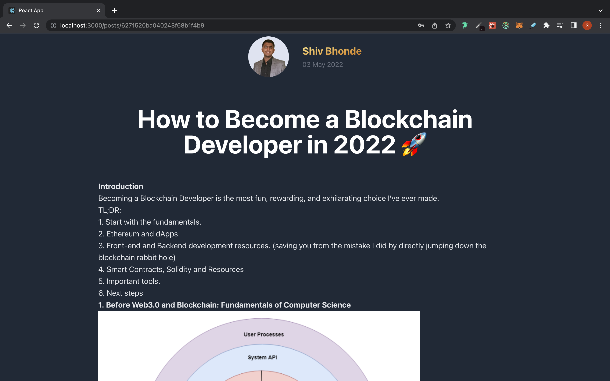

## Full Stack Blog Website

**Features** : 
 1. Not logged In user can view all/filter post on categories
 2. Once regesitered, Verification via email link to check authenticity of email address
 3. Logged in user can create post, update post using the markdown editor
 4. User can view others profile, follow others, likes others post.
 5. User accounte will be promoted to pro account once user has more than or eqal to 3 followers
 6. Users can send other user messages using the blog mail service.
 7. If the author uses profane words in post or message he will be blocked automatically
 8. Admin can view all the users and block/unblock users
 9. Admin can create/update/delete categories

## Public Pages 
### Home Page :

### Login Page :

### Register Page :

### All Post Page :

###  Single Post Page :

## Private Pages(Logged in User) 
### Profile Page :

### Create Post Page :

## Admin Pages(Logged in as Admin) 
### List of All authors Page :

### Create Cateogry Page :

### Add category  Page :

