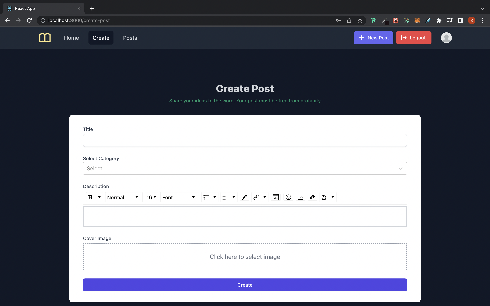

## Full Stack Blog Website(Soon It will be live)

A full stack blog application which is free from race and unhealthy words. This is a side project which I created to practice my web developments skills and also a boiler plate project trying to follow good folder structure and coding practices.

Backend - [https://github.com/technophile-04/blog-backend](https://github.com/technophile-04/blog-backend)

## Table of contents : 
- [Features](#features-)
- [Project Screen Shots](#project-screen-shots)
- [Installation and Setup Instructions](#installation-and-setup-instructions)

## Features : 
 1. Not logged In user can view all/filter post on categories
 2. Once registered, Verification via email link to check authenticity of email address
 3. Logged in user can create post, update post using the markdown editor
 4. User can view others profile, follow others, likes others post.
 5. User accounts will be promoted to pro account once user has more than or eqal to 3 followers
 6. Users can send other user messages using the blog mail service.
 7. If the author uses profane words in post or message he will be blocked automatically
 8. Users can also message authors via email (build in)
 9. Admin can view all the users and block/unblock users
 10. Admin can create/update/delete categories

## Project Screen Shots
### Public Pages 

#### Home Page :

#### Login Page :

#### Register Page :

#### All Post Page :

####  Single Post Page :

### Private Pages(Logged in User) 

#### Profile Page :

#### Create Post Page :

### Admin Pages(Logged in as Admin) 

#### List of All authors Page :

#### Create Cateogry Page :

#### Add category  Page :

# Installation and Setup Instructions

Clone down this repository. You will need `node` and `npm` installed globally on your machine.  

Installation:

    $ git clone https://github.com/technophile-04/blog-frontend.git
    $ cd blog-frontend
    $ npm install
    
Setup : 
To view the website locally you need to first run the server i.e backend check out [blog-backend](https://github.com/technophile-04/blog-backend) for backend code. You will be needing cloudinary preset and name.

Add cloudinary preset and name to `.env` by creating them. You can refer `.env.example` .

useful links : 

[https://cloudinary.com/documentation/upload_presets](https://cloudinary.com/documentation/upload_presets)

[https://www.youtube.com/watch?v=Rw_QeJLnCK4&t=20:35](https://www.youtube.com/watch?v=Rw_QeJLnCK4&t=20:35)

To View on browser App:

Run : 
    
    $ npm start

open `localhost:3000`  on browser.
